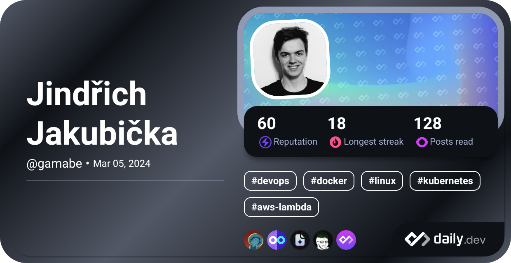

# Hi there, I'm Jindra 👋

**Infrastructure Developer**  
*Orchestrating the Cloud, One Cluster at a Time*

---

## 🚀 About Me

I'm passionate about building, automating, and scaling modern infrastructure. My expertise lies in designing cloud-native solutions and empowering teams with robust, automated environments.

- 🛠️ **Core Skills:** Kubernetes, Terraform, Docker
- 🏗️ I love turning complex infrastructure challenges into elegant, maintainable solutions.

---

## 🧰 Tech Stack

 

## Socials

<!--
**Jindra-Dev04/Jindra-Dev04** is a ✨ _special_ ✨ repository because its `README.md` (this file) appears on your GitHub profile.

Here are some ideas to get you started:

- 🔭 I’m currently working on ...
- 🌱 I’m currently learning ...
- 👯 I’m looking to collaborate on ...
- 🤔 I’m looking for help with ...
- 💬 Ask me about ...
- 📫 How to reach me: ...
- 😄 Pronouns: ...
- ⚡ Fun fact: ...
-->
